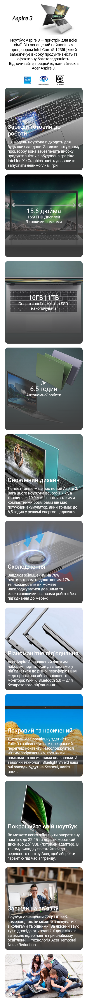

Layout for laptop Acer Aspire 3 A315-59.
This is the solution to the laptop Acer Aspire 3 A315-59 layout.

## Table of contents

- [Overview](#overview)
  - [The task](#the-task)
  - [Screenshot](#screenshot)
  - [Links](#links)
- [My process](#my-process)
  - [Built with](#built-with)
- [Author](#author)

## Overview

### The task

Users should be able to:

- View the optimal layout for the interface depending on their device's screen size
- The designs were created to the following widths:
  - Mobile: 320px
  - Desktop: 1024px and more

### Screenshot

Design desctop preview for the laptop Acer Aspire 3 A315-59

Design mobile preview for the laptop Acer Aspire 3 A315-59

### Links

- Solution URL: [GitHub Pages](https://github.com/OlSerkes/acer-aspire-3-A315-59)
- Live Site URL: [Live site URL](https://olserkes.github.io/acer-aspire-3-A315-59/)

### Built with

- HTML5 markup
- SASS preprocessor
- Positioning (relative, absolute)
- CSS Grid
- Mobile-first design

## Author

- Website - [Oleksandra Serkes](https://github.com/OlSerkes)
- Linkedin - [Oleksandra Serkes](https://www.linkedin.com/in/oleksandra-serkes-65580620a/)
